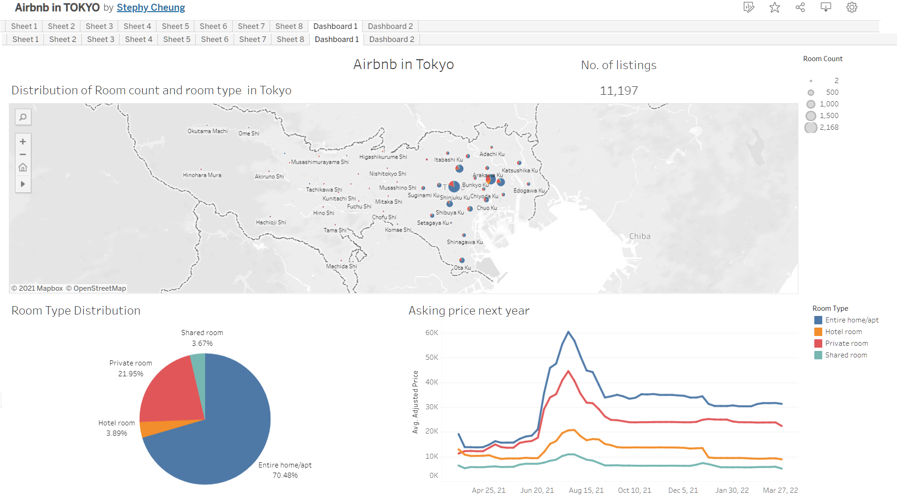
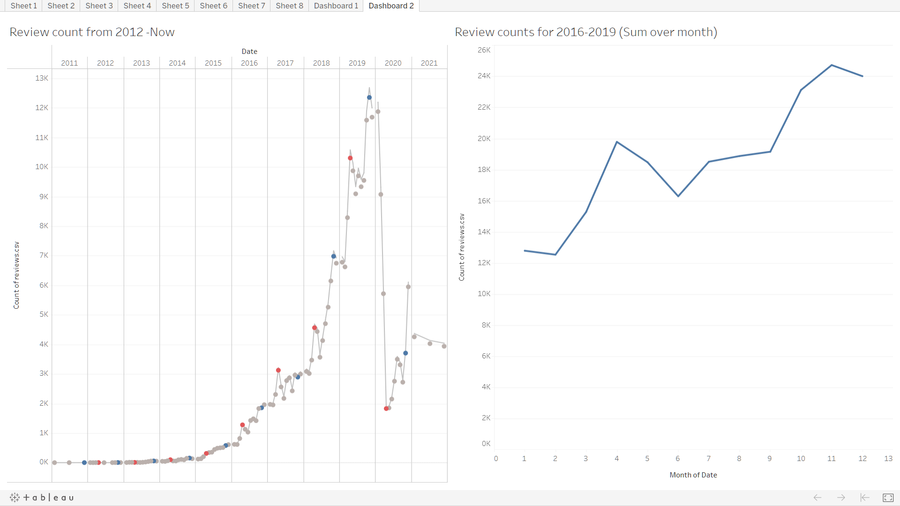

# Tableau project on Airbnb

This time we are looking on the open source data from Airbnb in Tokyo, Japan. Visulizing data and create business dashboard, to provide business insight for management. 

## General information about Airbnb in Tokyo, Japan

There are total of 11,197 listing rooms in Tokyo. It can be understand that popular tourist attraction area like Shinjuku Ku (large entertainment, business and shopping area) and Bunkyo Ku (location of Tokyo Dome) have the largest number of rooms. 

Majority of the listing rooms are entire home or apartment (70.48%), followed by private rooms(21.95%), and not more than 10% of the rooms are hotel rooms or shared rooms. The new home-sharing law enforced in 2018 by Japan Government and the emphasize of personal space and privacy in Japanese culture can explain the composition of room types of the current market. 

In terms of the pricing in the future one year, rental pricing for the entire home or apartment and private rooms are more sensitive to the external enviornment and local events -Tokyo Olympic Games. 
Since the society is still deeply affected by the current Covid-19 situation, the rooms are charing in April to June, and rockets in July as the Tokyo Olympic Games take place. 

## Insights from past performance

From the past performance, although the number of listing room is lower from 62K homes to around 10K homes after the new home-sharing law enforced by Japan Government in early [1], Airbnb recovered quickly and the number of usage in Airbnb rockets until the end of 2019 as the new home-sharing law requires the home owner registrate their properties. It makes Airbnb a more reliable services for travelers. The number of reviews experienced a large drop in 2020 and increase slowly again due to Covid-19 and the release of the inbound travel restrictions. We discovered there is a needs for inbound travel when the pandemic situation eases gradually. 

It is also interesting to note that there are peaks of the review number every year in April - May (mark in Red) and November - December (mark in Blue) before the pandemic. It matches the Golden week holidays in April - May in Japan, when Japanese people travels. 

## Results 
In conclusion, since 2021 is still deeply affected by Covid-19 and international travel is restricted, we would suggest operational should focus in inbound travel markets. Marketing efforts can be spent on boosting the local needs during the Japan public holidays and also advising the home owner focus on hygiene to provide a safe environment for travelers. It is also important to keep an eye on the pandemic situation and review the opeartional strategies from time to time according to the fast-changing pandemic situation.

## Reference
[1] Nearly 80 Percent of Japan's Airbnbs Were Just Removed: 
https://www.cntraveler.com/story/nearly-80-percent-of-japans-airbnbs-were-just-removed
